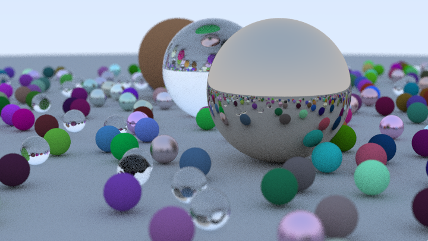

## python-ray-tracing-in-one-weekend
This repository is a python implementation of Peter Shirley's book series [Ray Tracing in One Weekend](https://raytracing.github.io/).

This is optimized for GPU (cuda-11.1.1).

